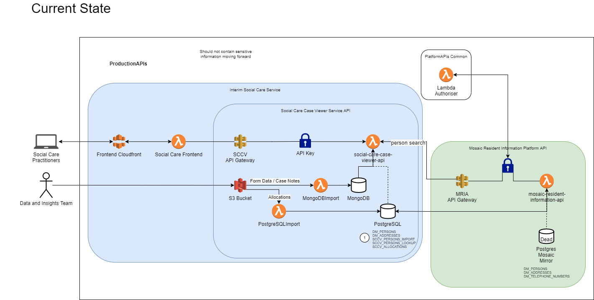
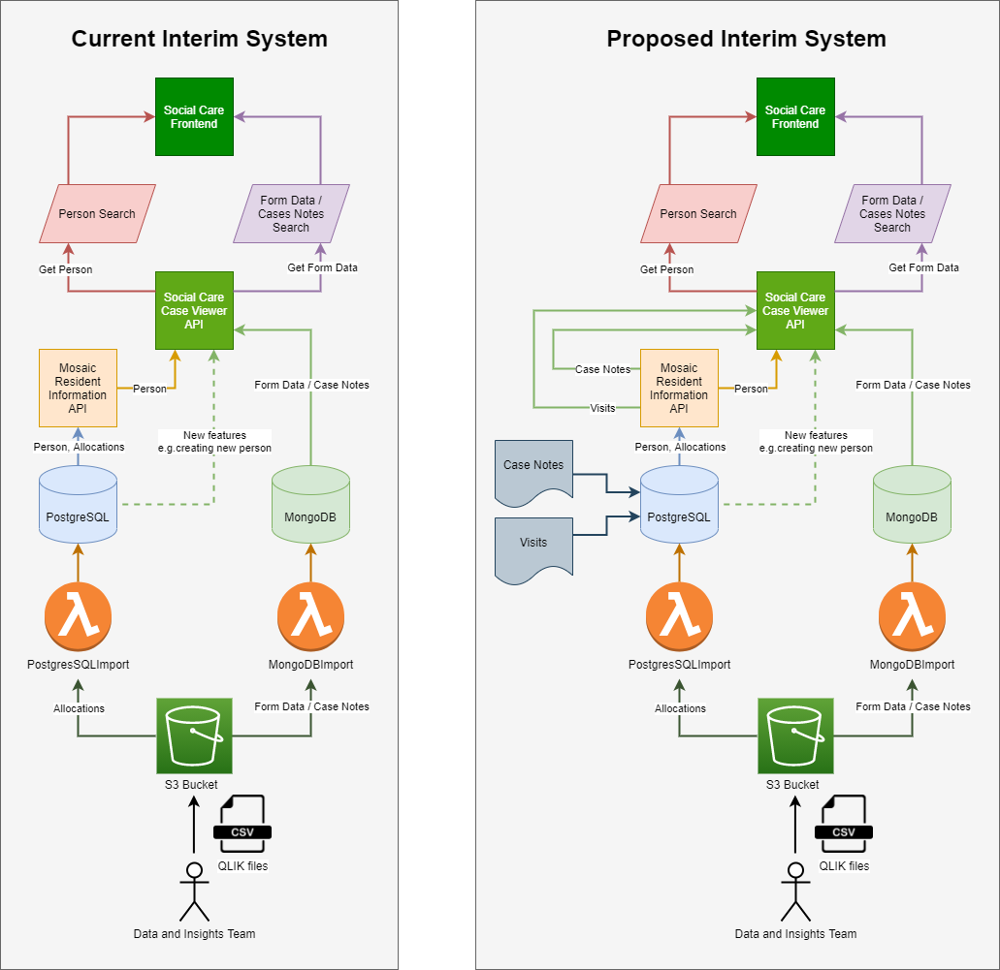

# Social Care System Architecture

This repository is a "central landing zone" to document and share the architecture of the interim social care system.

## Related Repositories

| Name                                                                                                     | Description                                                              |
|----------------------------------------------------------------------------------------------------------|--------------------------------------------------------------------------|
| [API-Playbook-v2-beta](https://github.com/LBHackney-IT/API-Playbook-v2-beta)                             | API design Guidance                                                      |
| [Hackney AWS Infrastructure](https://github.com/LBHackney-IT/infrastructure)                             | [IaC](https://en.wikipedia.org/wiki/Infrastructure_as_code) of AWS infra |
| [LBH Social Care](https://github.com/LBHackney-IT/lbh-social-care)                                       | Front End                                                                |
| [Social Care Case Viewer API](https://github.com/LBHackney-IT/social-care-case-viewer-api)               |                                                                          |
| [Residents Social Care Platform API](https://github.com/LBHackney-IT/residents-social-care-platform-api) |                                                                          |

## Context Diagram

The [context diagram](https://c4model.com/#SystemContextDiagram) shows the highest level of the Social Care system. It depicts the key users and systems.

## Container Diagram

The [container diagram](https://c4model.com/#ContainerDiagram) shows the interacting systems within the Social Care system.

## Architecture Decision Records

Lightweight architectural decision records are stored in the [decisions directory](decisions/README.md).

An architectural decision record (ADR) is a document that captures an important architectural decision made along with its context and consequences. Further information can be found on Michael Nygard's [blog](https://cognitect.com/blog/2011/11/15/documenting-architecture-decisions).

## Existing Documentation

Diagrams that existed prior to this repository are included for reference. The will be removed when they are superseded.

### Current State

[Drawio Image Source](images/2021-03-25-architecture.drawio)

### Data Flow

[Drawio Image Source](images/data-flows.drawio)
