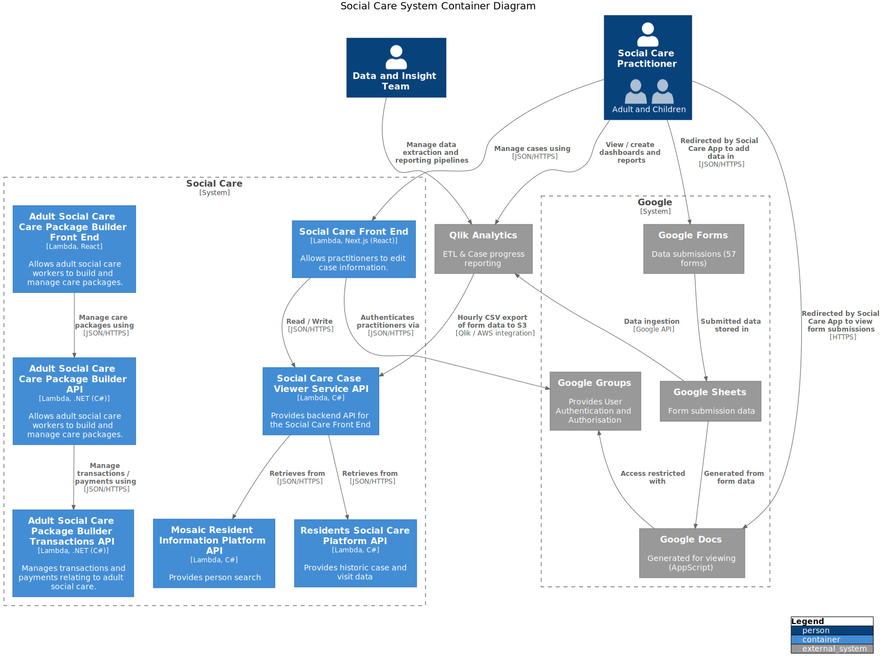

# Social Care System Architecture

This repository is a "central landing zone" to document and share the architecture of the interim social care system.

- [Vision](#vision)
- [Process and Tools](process.md)
- [Related Repositories](#related-repositories)
- [Context Diagram](#context-diagram)
- [Container Diagram](#container-diagram)
- [Deployment Diagram](#deployment-diagram)
- [Architecture Decision Records](#architecture-decision-records)
- [Existing Documentation](#existing-documentation)
  - [Current State](#current-state)
  - [Data Flow](#data-flow)

## Vision

The Social Care System was created as an interim system, in response to a loss of service.

## Related Repositories

| Name | Purpose |
|-|-|
| [LBH Social Care Frontend](https://github.com/LBHackney-IT/lbh-social-care-frontend) | Provides the UI/UX of the Social Care System. |
| [Social Care Case Viewer API](https://github.com/LBHackney-IT/social-care-case-viewer-api) | Provides [service API](http://playbook.hackney.gov.uk/API-Playbook/platform_api_vs_service_api#a-service-apis) capabilities to the Social Care System. |
| [Residents Social Care Platform API](https://github.com/LBHackney-IT/residents-social-care-platform-api) | Provides [platform API](http://playbook.hackney.gov.uk/API-Playbook/platform_api_vs_service_api#b-platform-apis) capabilities by providing historic social care data from Mosaic to the Social Care System. |
| [Infrastructure](https://github.com/LBHackney-IT/infrastructure) | Provides a single place for AWS infrastructure defined using [Terraform](https://www.terraform.io) as [infrastructure as code](https://en.wikipedia.org/wiki/Infrastructure_as_code) as part of Hackney's new AWS account strategy. NB: Due to its recent introduction, the Social Care System has infrastructure across multiple places. |
| [API Playbook](http://playbook.hackney.gov.uk/API-Playbook/) | Provides guidance to the standards of APIs within Hackney. |

## Context Diagram

The [context diagram](https://c4model.com/#SystemContextDiagram) shows the highest level of the Social Care system. It depicts the key users and systems.

## Container Diagram

The [container diagram](https://c4model.com/#ContainerDiagram) shows the interacting systems within the Social Care system.

## Deployment Diagram

The [deployment diagram](https://c4model.com/#ContainerDiagram) shows the key aspects of the deployed system in AWS.

## Architecture Decision Records

Lightweight architectural decision records are stored in the [decisions directory](decisions/README.md).

An architectural decision record (ADR) is a document that captures an important architectural decision made along with its context and consequences. Further information can be found on Michael Nygard's [blog](https://cognitect.com/blog/2011/11/15/documenting-architecture-decisions).
