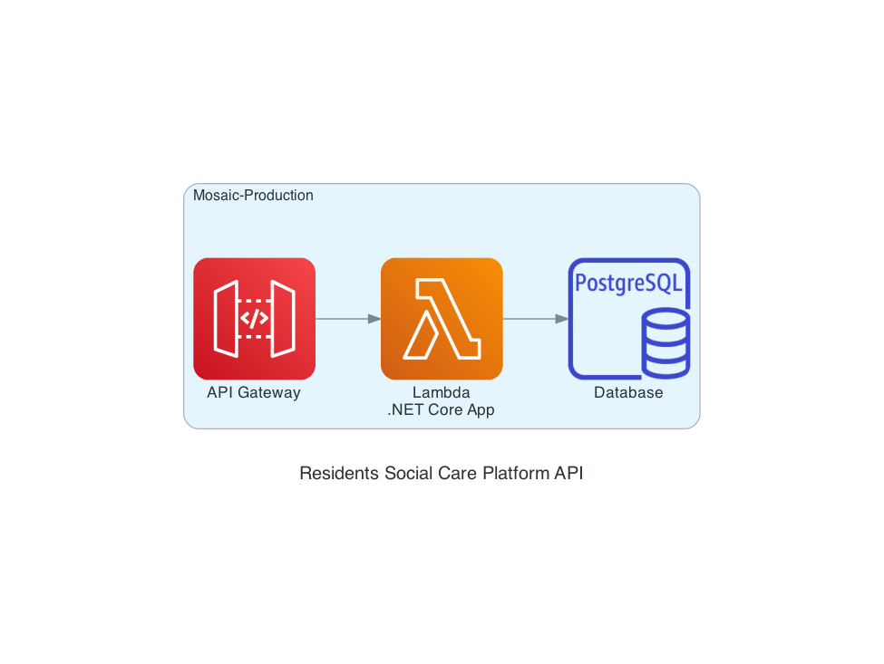

# Test


| PlantUML | Python |
| ------ | ----- |
|  |  |
| [test.iuml](test.iuml) | [test.py](test.py) |

## PlantUML

```
@startuml
!include <awslib/AWSCommon>
!include <awslib/General/all>
!include <awslib/Compute/all>
!include <awslib/Database/all>
!include <awslib/AWSSimplified>
!include <awslib/mobile/all.puml>
!include <awslib/Storage/all.puml>

skinparam linetype polyline
skinparam defaultTextAlignment center

title Residents Social Care Platform API

package "Mosaic-Production" {
    APIGateway(apiGateway, "API Gateway", "")
    Lambda(lambda, "Lambda\n.NET Core App", "")
    RDSPostgreSQLinstance(db, "Database", "")
    apiGateway -r-> lambda
    lambda -r-> db
}
@enduml
```

## Diagrams as Code using Python

```python
from diagrams import Cluster, Diagram
from diagrams.aws.compute import Lambda
from diagrams.aws.mobile import APIGateway
from diagrams.aws.database import RDSPostgresqlInstance
from diagrams.aws.database import RDSSqlServerInstance
from diagrams.aws.management import OrganizationsAccount

with Diagram("\nResidents Social Care Platform API", show=True, filename="platform-api-architecture"):
    with Cluster("Mosaic-Production"):
        APIGateway("API Gateway") >> Lambda("Lambda\n.NET Core App") >> RDSPostgresqlInstance("Database")

```
